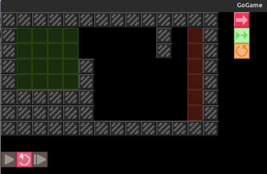
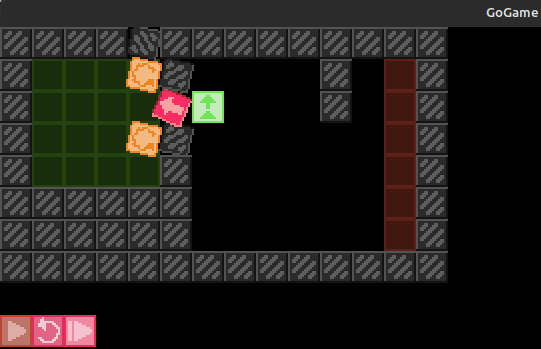

# GoGame
Simple game inspired by cell machine. Place cells and let them play on their own.

## Description
After play button is pressed, cells will behave according to their type, without player's intervention. The goal is to hit any of the red tiles. 

## Installation
There is a Linux build ready for use located in builds/ folder.

## Usage
In order to achieve victory player needs to place given cells in green areas and press play once all of given tiles are placed. After that cells will move, dublicate and rotate on their own. The challenge is to place cells the way they would hit red areas.

## Notes
Currentlly has ugly interface and only one map to play. There might be some bugs or even crushes, because the project is still in develpment and is not tested well. Windows build is currently broken.

## Screenshots

